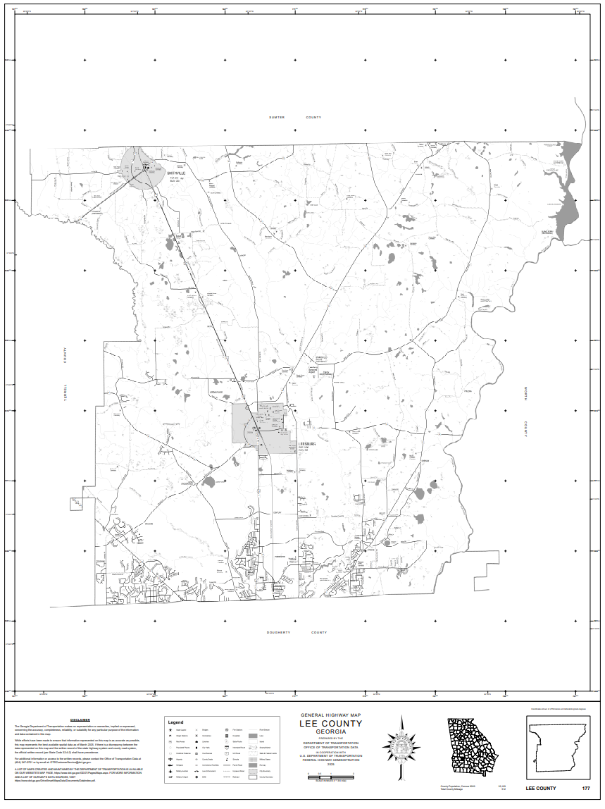
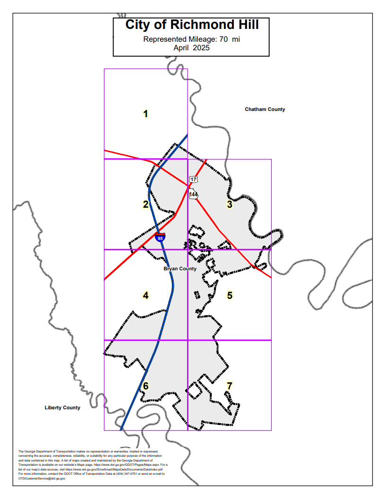
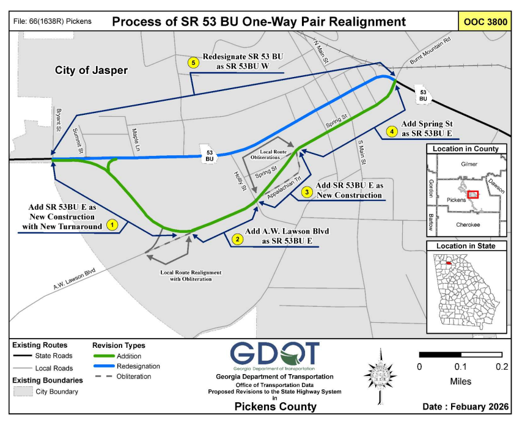

# GIS-Portfolio

Welcome to my GIS portfolio, which contains work from my time with the Georgia Department of Transportation
# About me
My name is Ryan, I graduated from Georgia State University with a Bachelors in geoscience and a concentration in environmental geoscience. I live in Atlanta, Georgia and currently work for the Georgia Department of Transportation as a GIS Analyst 3 and State Route Coordinator. I am interested in leveraging today's geospatial technology to work on tomorrow's transportation and environmental problems. 

· Data Analysis · Geographic Information Systems (GIS) · python · Remote Sensing · ArcGIS · QGIS · SQL

**Contact Me**

LinkedIn profile: www.linkedin.com/in/ryan-morgan1738/

Email: rtmorgan67@gmail.com

# Projects

**County Maps**

My first responsibility was creating county maps for each county in the state. These contained point symbols of public services like firestations, hospitals, law enforcement etc. These maps are printed and delivered to the counties on three year cycles. These maps are critical for GDOT's internal communication and planning.

**City Mapbooks**

Similar to county maps, GDOT creates official city maps for every city in Georgia. Click the image below to view entire mapbook.

**State Route Revisions**

With the help of my small team, I developed new workflows for maintaining and updating any changes to Georgia's State Route Network. This process begins with either a request from a municipality, or an order from the commissioner of GDOT. It is my team's duty to record mileage and road asset changes and to create maps that are added to legal documentation to be approved by the commissioner and municipality leaders. This work is critical as road mileage count has direct impact on city, county, and state budgets.

